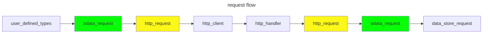
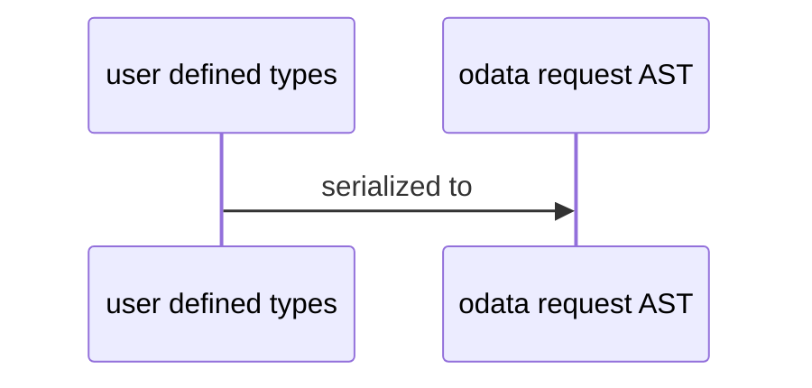
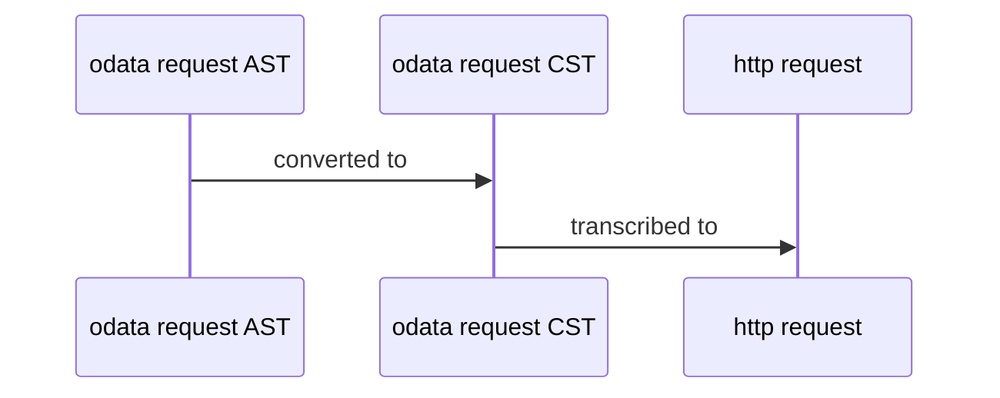
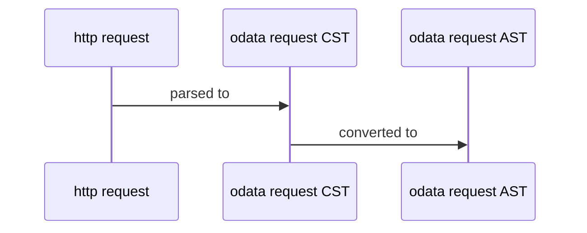
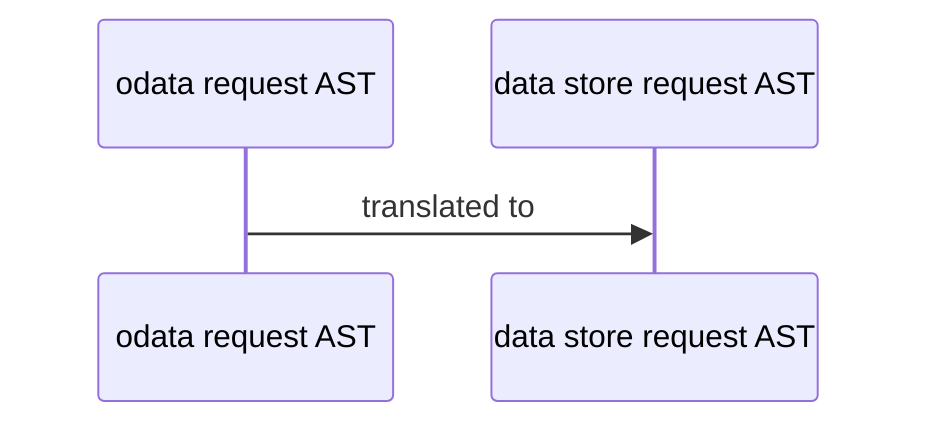
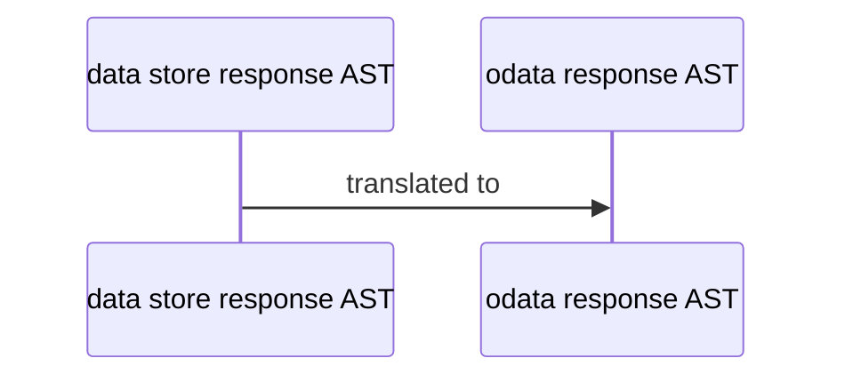
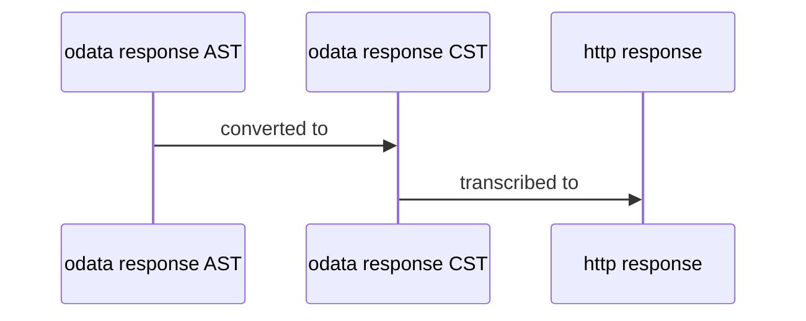
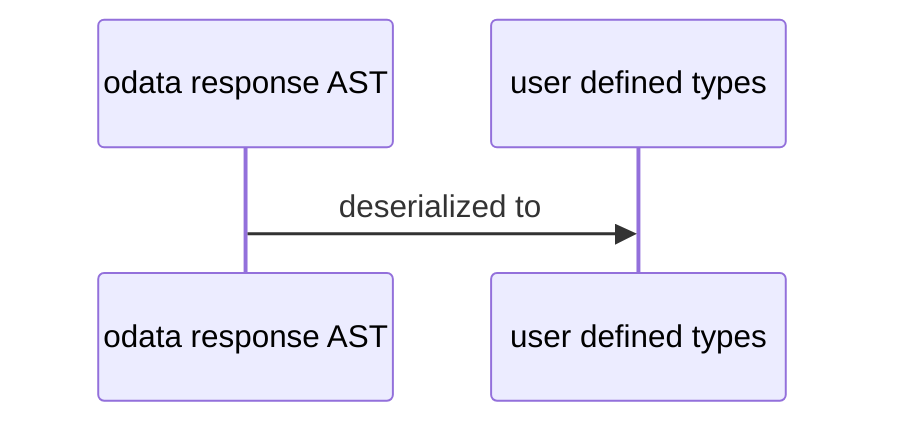

## goal

The goal is that an api producer can implement their service by handling requests using something as simple as `new OdataService(edmModel, dataProviders).HandleRequest(request)`.

Note that threading is left as a decision for the api producer *outside* of the context of implementing odata. They can use ASP.NET, azure functions, etc. to handle this; it should be orthogonal to the use of odata.

Also note that it is very useful for dataProviders to be modeled as OdataServices themselves because then an OdataService can be composed of multiple other OdataServices. A service can also be composed of multiple non-odata services that have been adapted into odata services.

Once data providers are seen as odata services themselves, we can also see that there will be at least one odata service implementation that is an odata client. This means that odata clients and odata services will have a unified interface and not differ from each other.

## architecture

The handling of an odata request involves 5 components:
1. csdl
2. http verb
3. uri
4. request body
5. response body

### avoiding customer-defined c# models (for now)

I want to take a moment now to convince why we should avoid dicsussing C# models for the time being and expect customers to rely strictly on odata types. This can be improved and built on top of in the future, and we **must** make certain that doing so is possible, or else our architecture will severely limit what customers can reasonably migrate to. Now for the convincing, consider the following CSDL:

```xml
<?xml version="1.0" encoding="utf-8"?>
<edmx:Edmx Version="4.0" xmlns:edmx="http://docs.oasis-open.org/odata/ns/edmx">
  <edmx:DataServices>
    <Schema Namespace="self" xmlns="http://docs.oasis-open.org/odata/ns/edm">
      <EntityType Name="customer">
        <Key>
          <PropertyRef Name="id" />
        </Key>
        <Property Name="id" Type="Edm.String" Nullable="false" />

        <Property Name="displayName" Type="Edm.String" Nullable="false" />
      </EntityType>

      <EntityType Name="product">
        <Key>
          <PropertyRef Name="id" />
        </Key>
        <Property Name="id" Type="Edm.Int32" Nullable="false" />
      </EntityType>

      <EntityType Name="order">
        <Key>
          <PropertyRef Name="id" />
        </Key>
        <Property Name="id" Type="Edm.String" Nullable="false" />

        <NavigationProperty Name="customer" Type="self.customer" Nullable="false" ContainsTarget="false" />
        <Property Name="items" Type="Collection(self.orderItem)" Nullable="false" />
      </EntityType>

      <ComplexType Name="orderItem">
        <NavigationProperty Name="product" Type="self.product" Nullable="false" ContainsTarget="false" />
        <Property Name="quantity" Type="Edm.Int32" Nullable="false" />
      </ComplexType>

      <EntityContainer Name="container">
        <EntitySet Name="customers" EntityType="self.customer" />
        <EntitySet Name="products" EntityType="self.product" />
        <EntitySet Name="orders" EntityType="self.order" />
      </EntityContainer>
    </Schema>
  </edmx:DataServices>
</edmx:Edmx>
```
With this model, it's reasonable that a client will want to place an order using an existing `customer`:
```http
POST /orders
```
```json
{
  "customer": {
    "@id": "Customers('ALFKI')"
  },
  "items": [
    {
      "product": {
        "@id": "Products(28)"
      },
      "quantity": 3
    },
    {
      "product": {
        "@id": "Products(43)"
      },
      "quantity": 5
    }
  ]
}
```
or creating a new `customer` (for first-time customers):
```http
POST /orders
```
```diff
{
  "customer": {
-   "@id": "Customers('ALFKI')"
+   "displayName": "Alfreds Futterkiste"
  },
  "items": [
    {
      "product": {
        "@id": "Products(28)"
      },
      "quantity": 3
    },
    {
      "product": {
        "@id": "Products(43)"
      },
      "quantity": 5
    }
  ]
}
```

Taking a naive approach to modeling the CSDL with C# types, we would have:
```csharp
class Customer
{
  public Customer(string id, string displayName)
  {
    this.Id = id;
    this.DisplayName = displayName;
  }

  public string Id { get; }
  public string DisplayName { get; }
}

class Product
{
  public Product(int id)
  {
    this.Id = id;
  }

  public int Id { get; }
}

class Order
{
  public Order(string id, Customer customer, IReadOnlyList<Item> items)
  {
    this.Id = id;
    this.Customer = customer;
    this.Items = items;
  }

  public string Id { get; }
  public Customer Customer { get; }
  public IReadOnlyList<Item> Items { get; }
}

class OrderItem
{
  public OrderItem(Product product, int quantity)
  {
    this.Product = product;
    this.Quantity = quantity;
  }

  public Product Product { get; }
  public int Quantity { get; }
}

class Client
{
  void CreateOrder(Order order);
}
```

If a client wants to call `CreateOrder`, how should they construct the `Order` instance for each case?
```csharp
var order = new Order(
  null, // point {1}: order id
  new Customer(
    "Customers('ALFKI')", // point {2}: customer id
    null), // point {3}: customer display name
  new[]
  {
    new OrderItem(
      new Product(
        28), // point {4}: product id
      3),
    new OrderItem(
      new Product(
        43), // point {4}: product id
      5),
  });
```

There are a number of issues:

#### {1} order id

When creating a new `order`, we don't yet have an `id`, so we have no value to put here. However, the `id` property is non-nullable. If we mark the `Id` property in C# as nullable, our model becomes incorrect when reading `order`s.

#### {2} customer id

The value provided for the `customer` `id` here is the **entity-id**, not the key property called `id`. The only reason this works at all is because the `id` property **happens** to be a `string`. More on this later.

#### {3} customer display name

Because we are referencing an existing `customer` and not creating a new one, there's no value for `displayName`. This has the same issues as {1} regarding the differences between C# classes for reading vs writing (we can mark `DisplayName` as nullable, but doing so means that our model for reads is now incorrect).

#### {4} product id

`28` is the value for the `id` property of the `product`, but what is needed for this bind operation is the **entity-id**. For `product`, unlike `customer`, our `id` proeprties are `int`, and so we have no way at all to provide the entity-id. Since there is no navigation property binding, it is only coincidence that we can look at the CSDL and know that the `product`s can be found in the `products` entity set.

For these reasons (and many others), I think it's best for now to simply understand that OData is too expressive for a simple C# data model to be used as an equivalent to the EDM model produced by CSDL. For this reason, I would like to leave the discussion of these C# data models to a later time. It is absolutely **required** that we have a design for such models, but I would like to first focus on representing the OData concepts themselves.

### data flow

https://mermaid.js.org/syntax/sequenceDiagram.html

```mermaid
---
title: response flow
---
flowchart LR
    data_store_response
    odata_response1[odata_response]
    http_response1[http_response]
    http_handler
    http_client
    http_response2[http_response]
    odata_response2[odata_response]
    user_defined_types

    data_store_response --> odata_response1
    odata_response1 --> http_response1
    http_response1 --> http_handler
    http_handler --> http_client
    http_client --> http_response2
    http_response2 --> odata_response2
    odata_response2 --> user_defined_types

    style odata_response1 fill:#08FF08
    style odata_response2 fill:#08FF08
    style http_response1 fill:#FBF719
    style http_response2 fill:#FBF719
```





Notice that in each case, the request and response types are the same for both the client and the service. These types can be shared but consumers of the odata libraries, but currently they are not. To see the impact of this sharing, let's dive into the mechanics of each translation of the data:

#### user defined types to odata request



#### odata request to http request



#### http request to odata request



#### odata request to data store request



#### data store response to odata response



#### odata response to http response



#### http response to odata response


#### odata response to user defined types




TODO notice that you can cut out HTTP now (not this above)


## follow-ups
1. being able to stream payloads
2. handling serialization of customer-defined types
3. CSDL defined authz
4. custom headers, query options, endpoints, etc.


