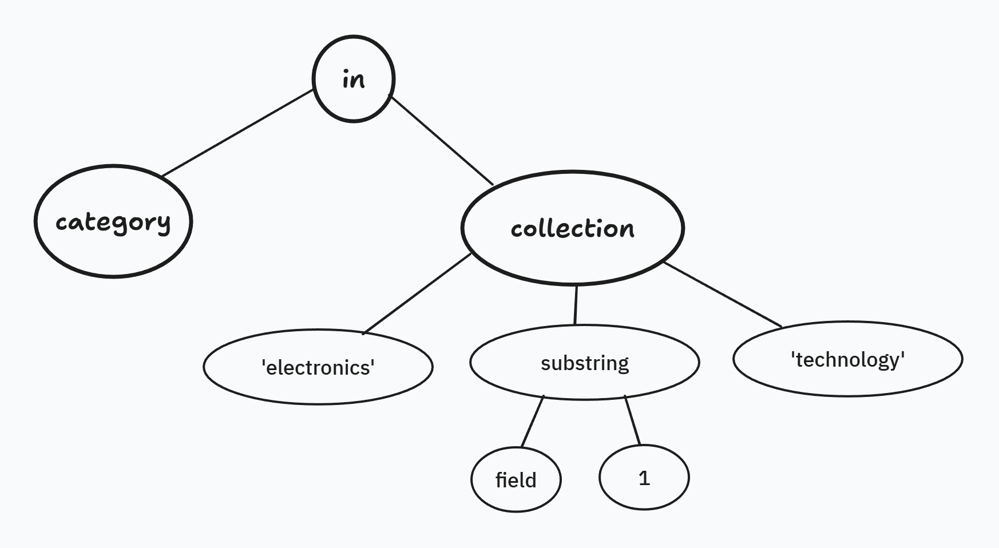
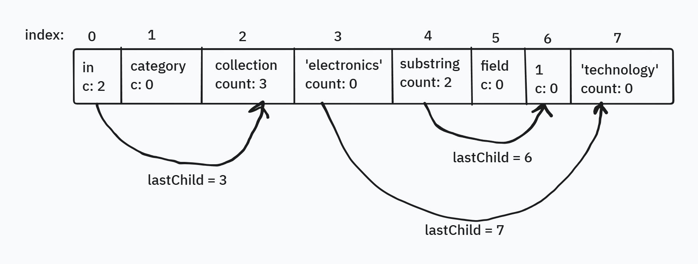

# OData URI Parser design change for higher performance and reliability

This is a proposal to rewrite the OData URI parser stack from the ground up based on a different architecture. The primary motivation for this proposal is performance,
but it also aims to make improvements to usability and developer experience.

## Motivations

### Performance

This proposal is part of larger effort to turn OData into a high-performance library. The URI parser is a key component of the OData experience as parsing the request URL is the first
step to handling and OData request. We have made efforts aimed at improving performance, the most recent being the [work by `xuhg` to use `ReadOnlySpan<char>` to cut down
string allocations](https://github.com/OData/odata.net/pull/3077). While we have seen improvements in such efforts, we're limited by the current architecture and public-facing APIs.
If we entertain a breaking change, we can change the architecture and redesign the parser for better performance and low resource use.

The aim of this effort to reach at least 5x improvement in performance and reduction in allocations on the core URI parser on benchmarks that demonstrate end-to-end semantic parsing of common URL patterns.

### Usability

The OData URI has two main parts, the path segments and query options. There different parsers for the path and the query options.
In general, each component has two parsing phases: syntactic parse and semantic parse. The syntactic parse is supposed to return a tree or sequence of nodes that represent the structure without binding model information. The semantic pass adds type information and validation from the model. However, the separation between syntax and semantic parse isn't cleanly implemented in all cases:

- The `SelectExpandSyntactiParser` which performs syntactic parsing of the select and expand query options is internal, meaning that end users cannot access it. It also has a dependency on `IEdmStructuredType`, meaning the model is required to use it. Customers have expressed interest in parsing URLs without the model.
- The path parser with parses the path segments simply splits the string on `/` slash symbols. As a result it doesn't properly handle cases where the keys in the path may contain slashes. [A comment in the code](https://github.com/OData/odata.net/blob/main/src/Microsoft.OData.Core/UriParser/Parsers/UriPathParser.cs#L55) suggests that this is a known bug.
- The `UriQueryOptionsParser` with does a lexical parse of some query options like `$filter` reads sequences delimited by `(` and `)` as single string. This means that items of literal collections cannot be individually consumed in the syntactic phase. These are properly parsed later in the semantic binder (for example, `FilterBinder`) where a model is required. This binding is also not ideal. For example, when parsing an `in` or `has` expression, the collection [literal is parsed by replacing the delimiting `(` and `)` with `[` and `]` and then calling the JsonReader to parse the array](https://github.com/OData/odata.net/blob/main/src/Microsoft.OData.Core/UriParser/Binders/InBinder.cs#L119). This "hack" is the cause of several bugs and incompalities related to the `in` operator, such as:
  - [](https://github.com/OData/odata.net/pull/3190)
  - https://github.com/OData/odata.net/issues/2875
  - https://github.com/OData/odata.net/issues/3098
  - https://github.com/OData/odata.net/pull/2711
  - [Source comment acknowleging flaws of this approach](https://github.com/OData/odata.net/blob/main/src/Microsoft.OData.Core/Uri/ODataUriConversionUtils.cs#L677).

The rewrite provides an opportunity to parse each expression properly from the lexical tokens up to the semantic nodes.

## High-level architectural changes

The key changes proposed:

- Avoid premature string allocations. Reference segments in the source string using `ReadOnlySpan<char>` until the user explicitly asks for a `string`.
- Store parsed nodes in array of structs instead of graph of objects.
- Frugal use of space, for example pack data in bit flags where applicable instead of separate bool fields. This helps keep the structs small and less expensive to move around.

Using an array of node structs is a common approach for memory-efficient parsers like `System.Text.Json`.

### Impact on customer-facing APIs and usability

A key side-effect of this approach is that user-facing nodes will not be class instances, but structs. This means no inhertiance. The developer will not rely on `is` operator or visitors based on polymorphism to process nodes.
They will rely on enums to distinguish between different node kinds and use methods such as `TryGetString()` or `TryGetInt()` or `EnumerateChildren()` to extract content from the nodes. This is similar to the `JsonDocument` and `JsonElement` APIs in `System.Text.Json`. We may consider adding a higher-level layer of class-based APIs if they provide significant value.

## Proof-concept and experiments

[This repository](https://github.com/habbes/experiments/tree/master/ODataSlimUrlParserConcept) contains the source code, benchmarks and experiments used in the proof-of-concept to demonstrate the feasibility of this proposal.

## Components

This section describes the proposal in more detail for each of the key components of the parser. The focus is on the query options parser, and the `$filter` query option in particular because of its complexity relative to other query options like `$select` and `$expand`. We'll also mention the path parser for completeness.

### Query options parser

The `ODataQueryOptionsParser` class is responsible for parsing the various query options in OData URL. `ODataQueryOptionParser` is not a single parser, but a wrapper around is different of query options.
This proposal focuses on `$filter` query options due to the relative complexity of its syntax compared to other query options like `$select` or `$expand`. Furthermore, there are similarities between
parsing `$filter` and other query options like `$apply` and `$orderby`.

Parsing a `$filter` expressions happen in three phases in a pipeline where the output of one phase is the input of the next. The follow table summarizes the phases and components that implement them:

| Phase  | Component | Description |
|--------|-----------|-------------|
| Tokenization | `ExpressionLexer` | Generates sequence of tokens from input string. At this phase we can destinguish between a keyword, a literal and an identifier. We can detect some syntax errors like unbalanced parantheses or unexpected end of input.|
| Abstract Syntax Tree | `UriQueryExpressionParser` | Generates a tree that represents the query expression. Each node in the tree is represent by a subclass of `QueryToken` class. At this stage we can tell the structure of an `or` operand and correctly order the operands based on precedence. We don't know the types of expressions. We can detect a function call and its parameters, but we can't tell the type or whether it exists.
| Semantic binding | `FilterBinder` | Attaches type information from the model to nodes in the AST. The nodes in the "semantic tree" are subclasses of `QueryNode`. At this stage we can tell the return type of function or property access. We can tell whether a property exists or not.

I propose to keep the same phases, but change how data is stored in memory for better efficiency, and ensure that each phase is "complete" (for example, don't perform tokenization of array elements in the semantic binding stage).

#### Allocation-free lexer

The current `ExpressionLexer` is an internal class that keeps a reference to the input string with the following key methods and properties:

- `NextToken()` reads the next token and advances the lexer to it.
- `TryPeekNextToken()` reads the next token but does not advance to it. This adds support for looking ahead when that's necessary to resolve some ambiguity.
- `CurrentToken` the current token. This returns an `ExpressionToken` which is a `struct` representing the current token. We use `ReadOnlyMemory` to reference the token text without allocating.

How the lexer is used: iteratively call `NextToken()` and check `CurrentToken` until you reach the end of input.

The proposed lexer to is very different from the existing, except for the following key differences:

- The lexer is a `ref struct` instead of a class. `ref struct` instead of plain `struct` because it has a `ReadOnlySpan<char>` field. This means it can only be used on the stack.
- The lexer holds a `ReadOnlySpan<char>` reference to the input Text
- The `CurrentToken` property returns an `Token` struct.
- The `ExpressionToken` struct has a `Range` property of type `ValueRange`. `ValueRange` is a struct that contains
- The lexer will read tokens from paranthesized expressions like collections. This will address a lot of errors we currently face based on our `in` implementation.

This parser does not allocate any objects to the heap as demonstrated by the following [benchmark](https://github.com/habbes/experiments/blob/master/ODataSlimUrlParserConcept/Benchmarks/ParserBenchmarks.cs#L102)
from the input string `"category eq 'electronics' or price gt 100"`.

The benchmarks compare parsing the following filter expression: `"category eq 'electronics' or price gt 100"`.

```md
BenchmarkDotNet v0.14.0, Windows 11 (10.0.26100.2314)
Intel Xeon W-2123 CPU 3.60GHz, 1 CPU, 8 logical and 4 physical cores
.NET SDK 9.0.100
  [Host]     : .NET 8.0.11 (8.0.1124.51707), X64 RyuJIT AVX-512F+CD+BW+DQ+VL
  DefaultJob : .NET 8.0.11 (8.0.1124.51707), X64 RyuJIT AVX-512F+CD+BW+DQ+VL
```

| Method                                   | Mean         | Error      | StdDev     | Gen0   | Allocated |
|----------------------------------------- |-------------:|-----------:|-----------:|-------:|----------:|
| **ParseExpression_SlimExpressionLexer**      |     90.21 ns |   1.688 ns |   1.579 ns |      - |         - |

See a sample implementation here: https://github.com/habbes/experiments/blob/master/ODataSlimUrlParserConcept/Lib/ExpressionLexer.cs.

See a sample usage here: https://github.com/habbes/experiments/blob/master/ODataSlimUrlParserConcept/SlimParserTests/ExpressionLexerTests.cs

#### Expression parsers and AST generation

The current `UriQueryExpressionParser` recursively parses a sequence of token into a tree based on the `QueryToken` class.

- Different subclasses of `QueryToken` represent different types of node.
- We allocate substrings of the input to store text values in the `QueryToken`s.
- Binary operator nodes have a reference to the left and right children and `QueryToken`.
- The `LiteralToken` is used to represent, among others, parenthesized expressions (e.g. collection expressions). The expression is still in unparsed string form.

This is where we propose a drastic change. Instead of nodes with direct reference to each other, we store nodes in a flat array.

A node would have roughly the following structure:

```csharp
internal struct ExpressionNode
{
    public ExpressionNodeKind Kind { get; internal set; }
    public ValueRange Range { get; internal set; }
    internal int Count { get; set; }
    internal int LastChild { get; set; }
    public bool IsTerminal => Count == -1;
}
```

And the expression parser will look roughly as follows:

```csharp
public ExpressionParser
{
    internal readonly ReadOnlyMemory<char> _source;
    internal NodeList<ExpressionNode> _nodes;
    
    public static QueryNode Parse(ReadOnlyMemory<char> source)
    {
        var lexer = new ExpressionLexer(_source.Span);
        int root = ParseExpression(ref lexer, ref _nodes, 0);
        return QueryNode(this, root);
    }
}
```

The `ExpressioNode` is an internal representation of any kind of node in the "tree". This struct is not exposed publicly.
Instead, we return a `QueryNode` struct which has the following structure:

```csharp
public struct QueryNode
{
    private int _index { get; set; }
    private ExpressionParser _parser { get; set; }
    
    public ExpressionNodeKind Kind => _parser[_index].Kind;
    public int GetIntValue()
    {
        return int.TryParse(_parser[_index].Range.GetValue(_parser.Source));
    }

    public string GetStringValue();
    public ReadOnlySpan<char> GetSpanValue();

    public int CollectionLength();
    public QueryNode GetItemAt(int index);
    public Enumerator EnumeratorItems();
    public QueryNode GetLeft();
    public QueryNode GetRight();
}
```

The public `QueryNode` struct is smaller than the internal `ExpressionNode` and would be cheaper to move around.

`ExpressionNode` can represent terminal nodes like primitives and identifiers, binary operators with a left and right child
and collections with an arbitrary number of children. It can also represent nodes with nested children.

- The `Count` property represents the number of top-level children a node has. The `LastChild` is the index of the last child in the array.
- We use `0` for the Count to represent terminal nodes
- The first child will always be the at parent's index + 1.

For nodes with non-nested children, we can easily find out in O(1):

- whether it has children, via the `Count` property
- the index of the child (`index + 1`)
- the index of any child (since we know where each child item will be)

However, if children are nested (e.g. an `or` node that has a left `and` node), it's harder to tell children are located. In this case,
we have to iterate through each child and skip over nested children to enumerate the top-level children. We can set the most significant bit to 1
to tell whether a node has "complex" or "nested" childs. If this bit is 0, we use the O(1) approach to find children by index, if the bit is 1 (i.e. `Count < 0`)
we use the iterative approach.

Let's use the following query to demonstrate how the array will be laid out:

```text
category in ('electronics', substring(field, 1), "technolgy")
```

Here's a tree representation of the query:



**Note** This is not how the current `UriQueryExpressionParser` represents this tree. Notably, it does not parse the the collection operand of and the `in` operator.

Here's how this would look like in the node array:



The downside of this approach is that there could be multiple nesting levels between two siblings of the same parent. That would require multiple hops of to skip over from one child to its next sibling. The number of hops is proportional to the level of nesting. If we have highly nested collections, this could noticeably slow down the iteration or indexing beyond O(n). If we anticipate highly nested collections, we could reduce the number of hops to one per sibling by storing more metadata about each child and level (TODO: demonstrate this).

How does the end user process this tree? Since we're using structs, we can't provide a traditional visitor that's based on inheritance. The basic approach is for the user to simply traverse the tree using the APIs on the `QueryNode` struct, like they would any other DOM-like structure. But this may be tedious for some cases. We can propose a handler that exposes a different method based on the type of node for convenience, e.g.:

```csharp
interface IQueryNodeHandler<T>
{   
    public T HandleIntNode(QueryNode intLiteralNode);
    public T HandleInNode(QueryNode inNode);
    public T HandleCollectionNode(QueryNode collection);
}
```

#### Semantinc binding

In the semantic node phase, we would start with a type that represent's the `IEdmType` of the path then traverse the expression starting from the route and bind a semantinc infomation like the `IEdmType` to each node. This semantic data could be stored in a separate array of the same size as the expression node array. Each index of the array will contain metadata that corresponds to the 

### Path parser

The current path parser is implemented in two phases:

1. [The `UriPathParser`](https://github.com/OData/odata.net/blob/main/src/Microsoft.OData.Core/UriParser/Parsers/UriPathParser.cs) splits the path into an `ICollection<string>` of segments using `/` as the separator. It doesn't check for presence of `/` charaters inside of string literals in key segments.
2. The internal [ODataPathParser](https://github.com/OData/odata.net/blob/main/src/Microsoft.OData.Core/UriParser/Parsers/ODataPathParser.cs) goes through each segment and binds to it a schema element and type. This steps returns an `IList<ODataPathSegment>` where `ODataPathSegment` in abstract class. Each type of segment is a subclass of `ODataPathSegment`, for example: `EntitySetSegment`, `EntityIdSegment`, etc.

Here are the proposed changes:

1. The lexer should not split the string. It should be an iterator that successively get the next each time `Read()` is called. Each token as span into the input string. There should be no heap allocations in this phase. We can also properly handle slash characters inside string literals.
2. The semantic parser progressively advances the tokenizer creating a semantic node for each segment. The semantic node would have roughly the following shape:

```csharp
internal readonly struct PathSegmentNode
{
    public PathSegmentKind Kind { get; }
    // index of the last child, for example if this is a function with args or a compound key.
    // So paths don't have nested children, we can easily compute the child based on the current index
    // and index of the last child.
    int LastChild { get; } 
    public ValueRange Range { get }
    public IEdmElement EdmElement { get;} // Should we make edm-element lookup lazy?
}
```

These nodes don't have a direct reference to the string, the range just contains the start and end, but don't point to the actual string. This makes the nodes flexible to use with either `ReadOnlySpan<char>` or `ReadOnlyMemory<char>`.
The `PathSegmentNode` is not exposed to the user, it needs to be linked to the parent list to be usable, it doesn't have enough context to be used as a standalone node. The is also relatively large and we don't want to incur the cost of direct copies.

The parsed path would look like:

```csharp
public sealed class PathSegmentList : IReadOnlyList<PathSegment>
{
    private PathSegmentNode[] _nodes;
    
    public PathSegment this[int index] => return new PathSegment(this, index);
}
```

The `PathSegment` is the public-facing type representing a path segment. It references the index of the `PathSegmentNode` in the list and exposes
method to extract data from the node based on its type.

