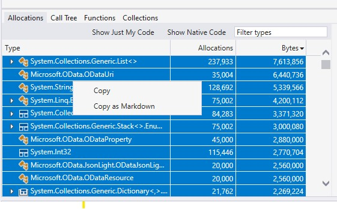
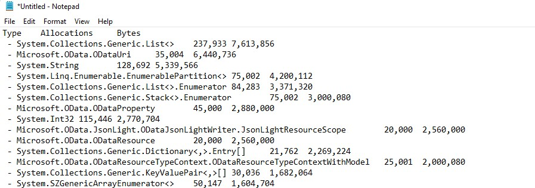

# Results Comparer

- [Overview](#overview)
- [Comparing BenchmarkDotNet benchmarks](#comparing-benchmarkdotnet-benchmarks)
- [Comparing Visual Studio Profiler Reports](#comparing-visual-studio-profiler-reports)
    - [Type Allocations](#type-allocations)
    - [Function Allocations](#function-allocations)

## Overview

This is a tool for comparing performance reports in order to quickly find regressions and improvements.

This tool is adapted from the results comparer in the [dotnet performance tools](https://github.com/dotnet/performance/tree/main/src/tools/ResultsComparer)

TODO:
- [x] Support BenchmarkDotNet Json reports
- [x] Support VS Profiler .NET Allocation Tracking reports
- [x] Support selecting metric to measure
- [x] Display new and missing results in output report
- [ ] Limit number of results
- [ ] Option to display short names (i.e. without namespace)
- [ ] Export comparison reports to CSV and markdown files
- [ ] Support VS Profiler CPU reports
- [ ] Support generic CSV reports
- [ ] Support comparing multiple files


It can be used to compare:
* historical results (eg. before and after my changes)
* results for different OSes (eg. Windows vs Ubuntu)
* results for different CPU architectures (eg. x64 vs ARM64)
* results for different target frameworks (eg. .NET Core 3.1 vs 5.0)

All you need to provide is:
* `--type` - the type of reports to compare, Examples `bdn`, `vsTypeAllocs`, `vsFuncAllocs` (learn more below). If not provided, the tool will attempt to auto-detect based on the input files.
* `--base` - path to folder/file with baseline results
* `--diff` - path to folder/file with diff results
* `--threshold`  - threshold for Statistical Test. Examples: 5%, 10ms, 100ns, 1s

Optional arguments:
* `--noise` - noise threshold for Statistical Test. The difference for 1.0ns and 1.1ns is 10%, but it's just a noise. Examples: 0.5ns 1ns. The default value is 0.3ns.
* `--metric` - the metric or data field to use for comparisons

Sample: compare the results stored in `C:\results\BenchmarkDotNetReportBefore.json` vs `C:\results\BenchmarkDotNetReportAfter.json` using `1%` threshold

```cmd
cd src/ResultsComparer

dotnet run -- --type bdn --base "C:\results\BenchmarkDotNetReportBefore.json" --diff "C:\results\BenchmarkDotNetReportAfter.json" --threshold 1%
```

## Comparing BencharmkDotNet benchmarks

**Note**: the tool supports only `*full.json` results exported by [BenchmarkDotNet](https://benchmarkdotnet.org) and those exported by [Microsoft.Crank](https://github.com/dotnet/crank) when running BenchmarkDotNet benchmaks.

To compare BenchmarkDotNet results, use `bdn` as the `--type` option
on the command line.

### Sample results

summary:
worse: 24, geomean: 1.224
total diff: 24

No Worse results for the provided threshold = 15% and noise filter = 0.3ns.

| Better                                                                           |          base/diff | Base Median (ns) | Diff Median (ns) | Modality|
| -------------------------------------------------------------------------------- | ------------------:| ----------------:| ----------------:| --------:|
| SerializationBaselineTests.SerializationBenchmarks.WriteODataSyncFile(dataSize:  |  1.239975815133238 |      25225200.00 |      20343300.00 |         |
| SerializationBaselineTests.SerializationBenchmarks.WriteODataSync(dataSize: 1000 | 1.2388368869437911 |      23862600.00 |      19262100.00 |         |
| SerializationBaselineTests.SerializationBenchmarks.WriteODataSync(dataSize: 5000 |  1.233939592367872 |     118341100.00 |      95905100.00 |         |
| SerializationBaselineTests.SerializationBenchmarks.WriteODataSync(dataSize: 1000 | 1.2335430442631166 |      25351900.00 |      20552100.00 |         |
| SerializationBaselineTests.SerializationBenchmarks.WriteODataSyncArrayPool(dataS |  1.231941215543009 |      23740000.00 |      19270400.00 |         |
| SerializationBaselineTests.SerializationBenchmarks.WriteODataSync(dataSize: 1000 | 1.2284255016635326 |     237077400.00 |     192992900.00 |         |
| SerializationBaselineTests.SerializationBenchmarks.WriteODataSync(dataSize: 1000 |   1.22785264176025 |     252622700.00 |     205743500.00 |         |
| SerializationBaselineTests.SerializationBenchmarks.WriteODataSyncFile(dataSize:  | 1.2273932985156952 |     123499700.00 |     100619500.00 |         |
| SerializationBaselineTests.SerializationBenchmarks.WriteODataSyncArrayPool(dataS | 1.2257649648623885 |     118660300.00 |      96805100.00 |         |
| SerializationBaselineTests.SerializationBenchmarks.WriteODataSyncFile(dataSize:  | 1.2254138911373726 |     260084050.00 |     212241800.00 |         |
| SerializationBaselineTests.SerializationBenchmarks.WriteODataSyncArrayPool(dataS |  1.224718105634736 |     237068500.00 |     193569850.00 |         |
| SerializationBaselineTests.SerializationBenchmarks.WriteODataSyncArrayPool(dataS |  1.223717766935697 |     126436600.00 |     103321700.00 |         |
| SerializationBaselineTests.SerializationBenchmarks.WriteODataSyncFile(dataSize:  | 1.2231833019136886 |     243478000.00 |     199052750.00 |         |
| SerializationBaselineTests.SerializationBenchmarks.WriteODataSyncArrayPoolFile(d | 1.2217044955515968 |     260673500.00 |     213368700.00 |         |
| SerializationBaselineTests.SerializationBenchmarks.WriteODataSyncArrayPoolFile(d | 1.2212590203356781 |     123509100.00 |     101132600.00 |         |
| SerializationBaselineTests.SerializationBenchmarks.WriteODataSync(dataSize: 5000 | 1.2198067351065485 |     125474200.00 |     102864000.00 |         |
| SerializationBaselineTests.SerializationBenchmarks.WriteODataSyncArrayPoolFile(d | 1.2197055673362414 |     129935600.00 |     106530300.00 |         |
| SerializationBaselineTests.SerializationBenchmarks.WriteODataSyncArrayPoolFile(d | 1.2182187163088392 |      24971900.00 |      20498700.00 |         |
| SerializationBaselineTests.SerializationBenchmarks.WriteODataSyncArrayPool(dataS |  1.218181364804361 |     251591850.00 |     206530700.00 |         |
| SerializationBaselineTests.SerializationBenchmarks.WriteODataSyncArrayPoolFile(d | 1.2181029952311364 |     243142250.00 |     199607300.00 |         |
| SerializationBaselineTests.SerializationBenchmarks.WriteODataSyncFile(dataSize:  | 1.2158922478078782 |      26332700.00 |      21657100.00 |         |
| SerializationBaselineTests.SerializationBenchmarks.WriteODataSyncFile(dataSize:  | 1.2127900327408094 |     129795700.00 |     107022400.00 |         |
| SerializationBaselineTests.SerializationBenchmarks.WriteODataSyncArrayPool(dataS |  1.211470433519456 |      25103000.00 |      20721100.00 |         |
| SerializationBaselineTests.SerializationBenchmarks.WriteODataSyncArrayPoolFile(d | 1.2045993443253906 |      26290200.00 |      21824850.00 |         |

No New results for the provided threshold = 15% and noise filter = 0.3ns.

No Missing results for the provided threshold = 15% and noise filter = 0.3ns.

## Comparing Visual Studio .NET Object Allocation Tracker Profiler reports

The tool currently supports comparing data generated by the [.NET Object Allocation Tracker](https://devblogs.microsoft.com/visualstudio/net-object-allocation-tool-performance/) and [Memory Usage](https://docs.microsoft.com/en-us/visualstudio/profiling/dotnet-alloc-tool?view=vs-2022) in the Visual Studio Profiler.

We currently don't support reading the actual `.diagsession` files generated by the profiler, and Visual Studio doesn't provide an export feature either. So to get a report this tool can read, you will have to manually copy it into a text file. To do so:
- Open the tab of the view you want to compare (e.g. `Allocations` or `Functions`)
- Select the rows you want to copy. To select the entire table, click the first row then scroll down and click the last row while holding down `Shift+A`
- Right-click then click **Copy**
- Open/Create an empty text file and paste the data there and save the file
- Do this for both the base and diff reports





With the files ready, you can run the command. We currently support data from the **Allocations** tab and **Functions** tab:

### .NET Object Allocation Tracker - Type Allocations

This is the **Allocations** tab of the profiler.This report shows the number and size of allocations for each data type.
For this type of report, use **`vsTypeAllocs`** as the `--type` option:

```
dotnet run -- --type vsTypeAllocs --base C:\reports\AllocationsReportBefore.txt --diff C:\reports\AllocationsReportAfter.txt
```

By default, the **Allocations** column is compared, but you can configure which metric to use for the comparison by using the `--metric` option. Possible values are (case-insensitive):
- `Allocations`
- `Size`
- `Bytes` (same as `Size`)


#### Sample Results

summary:
better: 1, geomean: 1.087
worse: 2, geomean: 1.014
new (results in the diff that are not in the base): 2
missing (results in the base that are not in the diff): 1
total diff: 6

| Worse        |          diff/base | Base Allocations | Diff Allocations | Modality|
| ------------ | ------------------:| ----------------:| ----------------:| --------:|
| System.Int32 | 1.0866205845157042 |        115446.00 |        125446.00 |         |

| Better                            |          base/diff | Base Allocations | Diff Allocations | Modality|
| --------------------------------- | ------------------:| ----------------:| ----------------:| --------:|
| System.String                     | 1.0238671079429735 |        128696.00 |        125696.00 |         |
| System.Collections.Generic.List<> | 1.0039367088607596 |        237933.00 |        237000.00 |         |

| New                               | diff/base | Base Allocations | Diff Allocations | Modality|
| --------------------------------- | --------- | ----------------:| ----------------:| -------- |
| Microsoft.OData.ODataProperty     | N/A       |                  |         45000.00 | N/A     |
| System.SZGenericArrayEnumerator<> | N/A       |                  |         50147.00 | N/A     |

| Missing                                     | diff/base | Base Allocations | Diff Allocations | Modality|
| ------------------------------------------- | --------- | ----------------:| ----------------:| -------- |
| System.Collections.ObjectModel.Collection<> | N/A       |        125001.00 |                  | N/A     |


### .NET Object Allocation Tracker - Function Allocations

This is the **Functions** tab of the profiler. This report show the number and size of allocations for each method. The methods are grouped by namespace, make sure to expand the namespaces you are interested in, otherwise their methods will not be included in the report when you copy-paste it.

For this type of report, use **`vsFuncAllocs`** as the `--type` option:


```
dotnet run -- --type vsFuncAllocs --base C:\reports\FuncAllocsBefore.txt --diff C:\reports\FuncAllocsAfter.txt
```

By default the Total Allocations metric is used for the comparison. But you can configure this by passing one of the following to the `--metric` option:
- `Total`: Total Allocations
- `Self`: Self Allocations
- `Size`: Size in bytes
- `Bytes`: Size in bytes (same as previous)

#### Sample Results

summary:
better: 1, geomean: 1.012
worse: 1, geomean: 1.008
new (results in the diff that are not in the base): 1
missing (results in the base that are not in the diff): 1
total diff: 4

| Worse                                    | diff/base | Base Self Allocations | Diff Self Allocations | Modality|
| ---------------------------------------- | ---------:| ---------------------:| ---------------------:| --------:|
| Microsoft.OData.ODataResourceBase.ctor() |    1.0125 |              80000.00 |              81000.00 |         |

| Better                   |          base/diff | Base Self Allocations | Diff Self Allocations | Modality|
| ------------------------ | ------------------:| ---------------------:| ---------------------:| --------:|
| microsoft.odata.core.dll | 1.0078836582276485 |             767068.00 |             761068.00 |         |

| New                                                  | diff/base | Base Self Allocations | Diff Self Allocations | Modality|
| ---------------------------------------------------- | --------- | ---------------------:| ---------------------:| -------- |
| Microsoft.OData.ODataValueUtils.ToODataValue(object) | N/A       |                       |              40006.00 | N/A     |

| Missing                                          | diff/base | Base Self Allocations | Diff Self Allocations | Modality|
| ------------------------------------------------ | --------- | ---------------------:| ---------------------:| -------- |
| Microsoft.OData.ODataPrimitiveValue.ctor(object) | N/A       |              80001.00 |                       | N/A     |


### Comparing Visual Studio Memory Usage reports

The Memory Usage profiler lets you take heap memory snapshots at different moments of your applications and you can analyze the live objects and references (both references to and references from) at specific snapshots. The profiler already has a diff-view that shows increases/decreases for each object type between two snapshots. This can be useful when tracking down memory leaks.

However, using this comparer can still make it easier to distinguish types that have increased/decreased between two snapshots. It can also help you compare snapshots from different sessions. When using this comparer tool, you should compare reports from the full detailed view rather than the diff views

For this type of report, use **`vsMem`** as the `--type` option:


```
dotnet run -- --type vsFuncAllocs --base C:\reports\MemoryUsageBefore.txt --diff C:\reports\MemoryUsageAfter.txt
```

By default the "Count" metric is used for the comparison, but you can change the metric used by passing one of the following to the `--metric` options:
- `Count`: Count of instances in memory
- `Size`: Size in bytes
- `Bytes`: Size in bytes (same as previous)
- `Inclusive Size`: Inclusive size in bytes
- `Inclusive Bytes`: Inclusive size in bytes (same as previous)